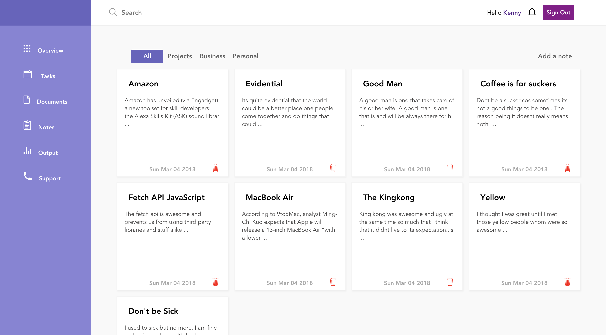
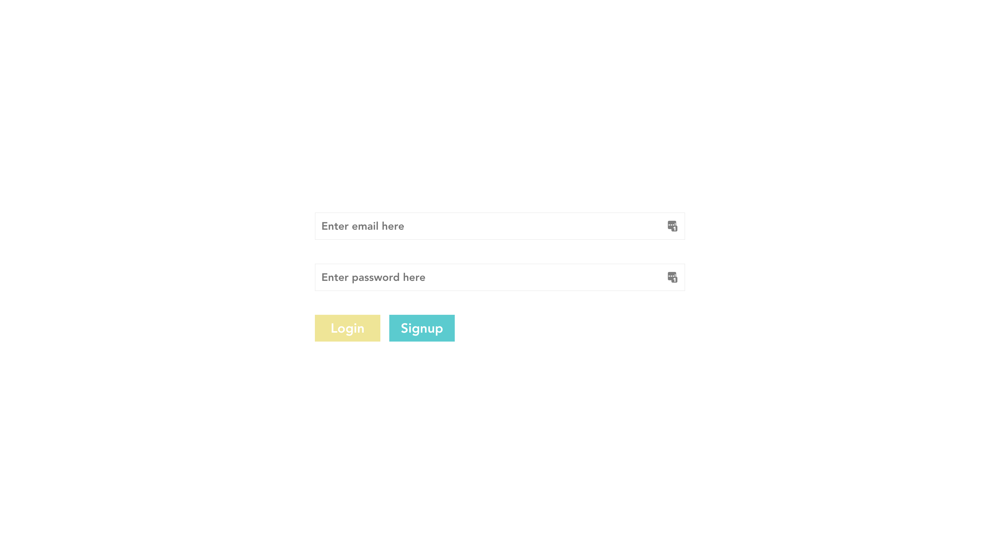
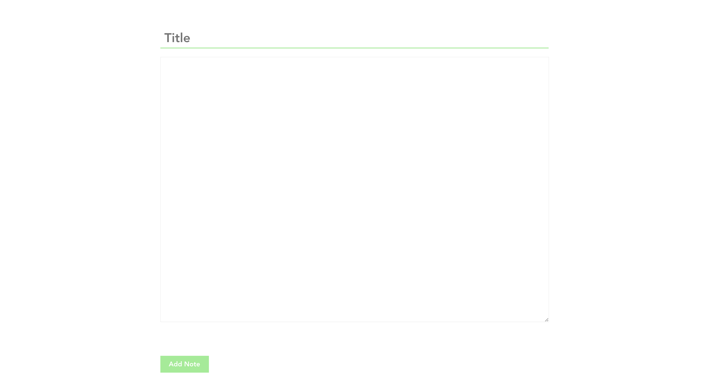

# Good Notes

Good notes is a complete single page application written completely in React with React router for routing.
It is a notes app that anyone can use and extend as it is very modular. Anyone with some JS knowledge could completely add more features to this application. I wanted to have a beautiful notes app that was written by myself and contained the features and simplicity I have always wanted myself. Another reason why I did this was to expound on my react knowlegde. It was my first using react-router;

# Requirements

1.  Node.js
2.  yarn or NPM
3.  A laptop that isn't from 1998??
4.  Common sense

## Installation

```javascript
npm install
```

## Usage

```js
  yarn start
```

When you start the application it takes you to the login page, you can either sign in or signup for an account. To do this you need to have
a firebase account and make sure you have enabled read and write permissons to database. Only make sure you enabled signin with email and password
in the authentication tab in the firebase console.

**Import**
You need to created a config.js with the credentials you get from firebase.
It should look something like this

```js
var config = {
  apiKey: "",
  authDomain: "",
  databaseURL: "",
  projectId: "",
  storageBucket: "",
  messagingSenderId: ""
};

export default config;
```

Once you done this, the app should be ready to use using the `yarn start` or `npm start`

# Features

* Authentication
* React Router
* Verification and validation
* A beautiful interface inp

Credits: Main page design 98% inspiration from [Valeria Rimkevich](https://dribbble.com/shots/3603745-Notes-screen)

# To-do

- [x] Search Feature
- [x] Add way to edit
- [ ] Add more routes
- [x] Front-end validation
- [ ] Mobile version
- [x] Modal to edit the info
- [ ] File Upload
- [ ] Maybe a quill like editor: implemented earlier but had to remove due to issues
- [X] Fix deletion, deletes but tries to edit at the same time due to position of the delete button
 
## Components

1.  main.js : The page where all notes are displayed
2.  header.js : The navbar
3.  login.js : duhhh
4.  addnote: The component responsible for adding notes
5.  sidebar.js : The sidebar you see
6.  router.js : Contains all react router definitions for the routers above

## Screen shots

### Main Notes Page



### Login & SignUp Page



### Minamalistic Add Notes Pages


